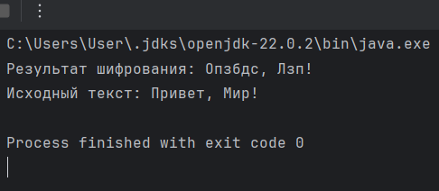
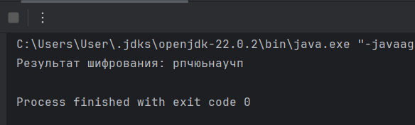

---
## Front matter
title: "Отчет по лабораторной работе"
subtitle: "Шифры простой замены"
author: "Арам Грачьяевич Саргсян"

## Generic otions
lang: ru-RU
toc-title: "Содержание"

## Bibliography
bibliography: bib/cite.bib
csl: pandoc/csl/gost-r-7-0-5-2008-numeric.csl

## Pdf output format
toc: true # Table of contents
toc-depth: 2
lof: true # List of figures
lot: true # List of tables
fontsize: 12pt
linestretch: 1.5
papersize: a4
documentclass: scrreprt
## I18n polyglossia
polyglossia-lang:
  name: russian
  options:
	- spelling=modern
	- babelshorthands=true
polyglossia-otherlangs:
  name: english
## I18n babel
babel-lang: russian
babel-otherlangs: english
## Fonts
mainfont: IBM Plex Serif
romanfont: IBM Plex Serif
sansfont: IBM Plex Sans
monofont: IBM Plex Mono
mathfont: STIX Two Math
mainfontoptions: Ligatures=Common,Ligatures=TeX,Scale=0.94
romanfontoptions: Ligatures=Common,Ligatures=TeX,Scale=0.94
sansfontoptions: Ligatures=Common,Ligatures=TeX,Scale=MatchLowercase,Scale=0.94
monofontoptions: Scale=MatchLowercase,Scale=0.94,FakeStretch=0.9
mathfontoptions:
## Biblatex
biblatex: true
biblio-style: "gost-numeric"
biblatexoptions:
  - parentracker=true
  - backend=biber
  - hyperref=auto
  - language=auto
  - autolang=other*
  - citestyle=gost-numeric
## Pandoc-crossref LaTeX customization
figureTitle: "Рис."
tableTitle: "Таблица"
listingTitle: "Листинг"
lofTitle: "Список иллюстраций"
lotTitle: "Список таблиц"
lolTitle: "Листинги"
## Misc options
indent: true
header-includes:
  - \usepackage{indentfirst}
  - \usepackage{float} # keep figures where there are in the text
  - \floatplacement{figure}{H} # keep figures where there are in the text
---

# Цель работы

Познакомиться с шифрами простой замены

# Задание

1 Реализовать шифр Цезаря с произвольным ключои
2 Реализовать шифр Атбаш

# Выполнение лабораторной работы

1 Я реализовал шифр Цезаря с произвольным ключом (рис. [-@fig:001]).

```
public class CaesarCipherCyrillic {

    public static String encrypt(String text, int key) {
        StringBuilder result = new StringBuilder();
        key = key % 32; // Длина кириллического алфавита

        for (int i = 0; i < text.length(); i++) {
            char ch = text.charAt(i);
            if (ch >= 'А' && ch <= 'Я') { // Uppercase Cyrillic
                ch = (char) ((ch - 'А' + key) % 32 + 'А');
            } else if (ch >= 'а' && ch <= 'я') { // Lowercase Cyrillic
                ch = (char) ((ch - 'а' + key) % 32 + 'а');
            }
            result.append(ch);
        }
        return result.toString();
    }

    public static String decrypt(String text, int key) {
        return encrypt(text, 32 - (key % 32)); 
    }

    public static void main(String[] args) {
        String originalText = "Привет, Мир!";
        int key = 31;

        String encryptedText = encrypt(originalText, key);
        System.out.println("Результат шифрования: " + encryptedText);

        String decryptedText = decrypt(encryptedText, key);
        System.out.println("Исходный текст: " + decryptedText);
    }
}

```

{#fig:001 width=70%}

2 Я реализовал шифр Атбаш (рис. [-@fig:002]).
```
public class AtbashCipherCyrillic {

    private static final String ALPHABET = "абвгдежзийклмнопрстуфхцчшщьыэюя ";

    public static String atbash(String text) {
        StringBuilder result = new StringBuilder();

        for (int i = 0; i < text.length(); i++) {
            char ch = text.charAt(i);
            int index = ALPHABET.indexOf(ch);
            if (index != -1) {
                char mirroredChar = ALPHABET.charAt(ALPHABET.length() - 1 - index);
                result.append(mirroredChar);
            } else {
                result.append(ch);
            }
        }
        return result.toString();
    }

    public static void main(String[] args) {
        String originalText = "привет мир";
        String encryptedText = atbash(originalText);
        System.out.println("Результат шифрования: " + encryptedText);
    }
}


```

{#fig:002 width=70%} 

# Выводы

Я познакомился с шифрами простой замены
