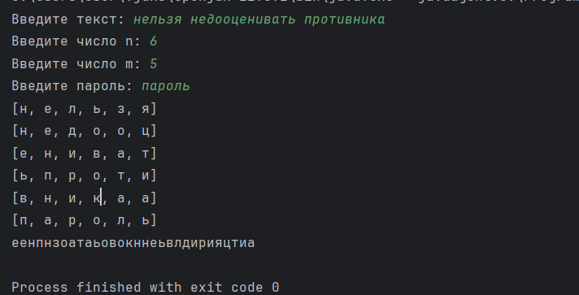
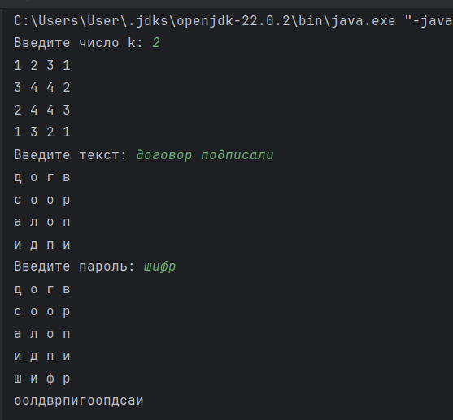
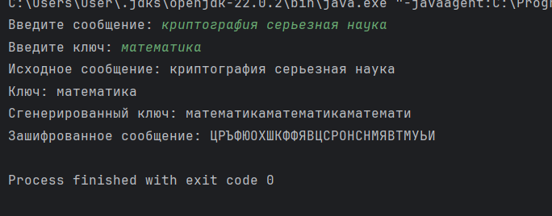

---
## Front matter
lang: ru-RU
title: Презентация по лабораторной работе №2
subtitle: Шифры перестановки
author:
  - Саргсян А. Г.
institute:
  - Российский университет дружбы народов, Москва, Россия
date: 28 сентября 2024

## i18n babel
babel-lang: russian
babel-otherlangs: english

## Formatting pdf
toc: false
toc-title: Содержание
slide_level: 2
aspectratio: 169
section-titles: true
theme: metropolis
header-includes:
 - \metroset{progressbar=frametitle,sectionpage=progressbar,numbering=fraction}
---

# Цель работы 

## Цели и задачи работы
Цели:

Познакомиться с шифрами перестановки

Задачи:

- Реализовать шифр маршрутной перстановки
- Реализовать шифр с помощью решеток
- Реализовать шифр Виженера

# Ход работы

## Маршрутное шифрование

{#fig:001 width=70%}

## Шифр решетки

{#fig:002 width=70%} 

## Шифр Виженера

{#fig:003 width=70%} 

# Выводы

## Выводы

Я познакомился со шифрами перестановки.