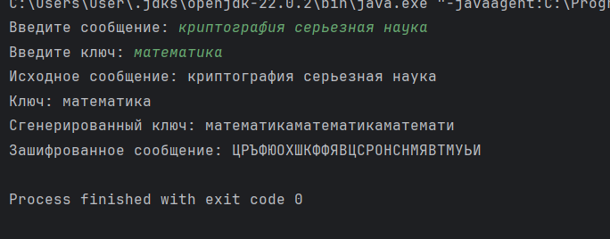

---
## Front matter
title: "Отчет по лабораторной работе №2"
subtitle: "Шифры перестановки"
author: "Арам Грачьяевич Саргсян"

## Generic otions
lang: ru-RU
toc-title: "Содержание"

## Bibliography
bibliography: bib/cite.bib
csl: pandoc/csl/gost-r-7-0-5-2008-numeric.csl

## Pdf output format
toc: true # Table of contents
toc-depth: 2
lof: true # List of figures
lot: true # List of tables
fontsize: 12pt
linestretch: 1.5
papersize: a4
documentclass: scrreprt
## I18n polyglossia
polyglossia-lang:
  name: russian
  options:
	- spelling=modern
	- babelshorthands=true
polyglossia-otherlangs:
  name: english
## I18n babel
babel-lang: russian
babel-otherlangs: english
## Fonts
mainfont: IBM Plex Serif
romanfont: IBM Plex Serif
sansfont: IBM Plex Sans
monofont: IBM Plex Mono
mathfont: STIX Two Math
mainfontoptions: Ligatures=Common,Ligatures=TeX,Scale=0.94
romanfontoptions: Ligatures=Common,Ligatures=TeX,Scale=0.94
sansfontoptions: Ligatures=Common,Ligatures=TeX,Scale=MatchLowercase,Scale=0.94
monofontoptions: Scale=MatchLowercase,Scale=0.94,FakeStretch=0.9
mathfontoptions:
## Biblatex
biblatex: true
biblio-style: "gost-numeric"
biblatexoptions:
  - parentracker=true
  - backend=biber
  - hyperref=auto
  - language=auto
  - autolang=other*
  - citestyle=gost-numeric
## Pandoc-crossref LaTeX customization
figureTitle: "Рис."
tableTitle: "Таблица"
listingTitle: "Листинг"
lofTitle: "Список иллюстраций"
lotTitle: "Список таблиц"
lolTitle: "Листинги"
## Misc options
indent: true
header-includes:
  - \usepackage{indentfirst}
  - \usepackage{float} # keep figures where there are in the text
  - \floatplacement{figure}{H} # keep figures where there are in the text
---

# Цель работы

Познакомиться с шифрами перестановки

# Задание

1. Реализовать шифр маршрутной перстановки
2. Реализовать шифр с помощью решеток
3. Реализовать шифр Виженера

# Теоритическое введение

## Маршрутное шифрование

Для шифрования открытый текст разбивается на блоки равной длины, равному произведению
чисел mn. Если последний блок получится меньше остальных, то в него следует дописать требуемое количество символов.
Буквы выписывают по столбцам, внизу приписывается пароль из неповторяющихся букв. 
В ответе будут столбцы по алфавитному порядку букв пароля.

## Шифрование с помощью решеток

Для начала рассматиравется квадрат размерности k. Потом квадрат дополняется его поворотными вариациями.
После из квадрата вырезаются числа от 1 до $k^2$. И так последовательно заполняется текст в решетки.
Остальое аналогично маршрутному шифрованию.

## Шифр Виженера

Открытый текст разбивается на длину n. Исходный текст и пароль сопоставляются к друг другу. 
И выбирается буква согласно соответствию таблице.

# Выполнение лабораторной работы

1 Я реализовал маршрутное шифрование (рис. [-@fig:001]).

```
import java.util.ArrayList;
import java.util.Collections;
import java.util.Scanner;

public class MarhsrutCipher {
    public static void main(String[] args) {
        Scanner scanner = new Scanner(System.in);
        System.out.print("Введите текст: ");
        String text = scanner.nextLine().replace(" ", "");
        System.out.print("Введите число n: ");
        int n = scanner.nextInt();
        System.out.print("Введите число m: ");
        int m = scanner.nextInt();
        scanner.nextLine(); // Очистить буфер сканера
        System.out.print("Введите пароль: ");
        String passwd = scanner.nextLine();
        ArrayList<ArrayList<Character>> lists = new ArrayList<>();
        int it = 0; // итератор
        // Заполняем массив символами из текста
        for (int i = 0; i < m; i++) {
            ArrayList<Character> row = new ArrayList<>();
            for (int j = 0; j < n; j++) {
                if (it < text.length()) {
                    row.add(text.charAt(it));
                    it++;
                } else {
                    row.add('a'); // Добавляем 'a', если текст закончился
                }
            }
            lists.add(row);
        }
        // Добавляем пароль в качестве последней строки
        ArrayList<Character> lis = new ArrayList<>();
        for (int i = 0; i < n; i++) {
            lis.add(passwd.charAt(i));
        }
        lists.add(lis);
        // Выводим таблицу
        for (ArrayList<Character> list : lists) {
            System.out.println(list);
        }
        // Создаем отсортированный список из последней строки
        ArrayList<Character> list = new ArrayList<>(lists.getLast());
        Collections.sort(list);
        StringBuilder result = new StringBuilder();
        for (Character c : list) {
            int index = lists.getLast().indexOf(c);
            for (int i = 0; i < lists.size() - 1; i++) { // Исключаем последнюю строку
                result.append(lists.get(i).get(index));
            }
        }
        System.out.println(result);
        scanner.close();
    }
}
```

{#fig:001 width=70%}

2 Я реализовал шифр решеткой (рис. [-@fig:002]).

```
import java.util.*;
import java.util.Scanner;

public class CardanGrille {

    public static void printMatrix(List<List<String>> lists1) {
        for (List<String> row : lists1) {
            for (String elem : row) {
                System.out.print(elem + " ");
            }
            System.out.println();
        }
    }

    public static List<List<String>> rotate90(List<List<String>> matrix) {
        List<List<String>> rotated = new ArrayList<>();
        int size = matrix.size();
        for (int i = 0; i < size; i++) {
            List<String> row = new ArrayList<>();
            for (int j = size - 1; j >= 0; j--) {
                row.add(matrix.get(j).get(i));
            }
            rotated.add(row);
        }
        return rotated;
    }

    public static void removeElement(List<List<String>> largelist, String inn, int k) {
        for (int i = 0; i < k * 2; i++) {
            for (int j = 0; j < k * 2; j++) {
                if (largelist.get(i).get(j).equals(inn)) {
                    largelist.get(i).set(j, " ");
                    return;
                }
            }
        }
    }

    public static void cardanGrille() {
        Scanner scanner = new Scanner(System.in);
        System.out.print("Введите число k: ");
        int k = scanner.nextInt();
        scanner.nextLine();  // Захват символа новой строки после nextInt()
        int s = 1;

        // Инициализация основной матрицы
        List<List<String>> lists = new ArrayList<>();
        for (int i = 0; i < k; i++) {
            List<String> row = new ArrayList<>();
            for (int j = 0; j < k; j++) {
                row.add(String.valueOf(s));
                s++;
            }
            lists.add(row);
        }

        // Вращаем матрицы
        List<List<String>> lists1 = rotate90(lists);
        List<List<String>> lists2 = rotate90(lists1);
        List<List<String>> lists3 = rotate90(lists2);

        // Создаем и заполняем больший массив
        List<List<String>> largelist = new ArrayList<>();
        for (int i = 0; i < k * 2; i++) {
            List<String> row = new ArrayList<>(Collections.nCopies(k * 2, "1"));
            largelist.add(row);
        }

        // Заполняем больший массив элементами вращенных матриц
        for (int i = 0; i < k; i++) {
            for (int j = 0; j < k; j++) {
                largelist.get(i).set(j, lists.get(i).get(j));
            }
        }

        int i1 = 0, j1 = 0;
        for (int i = 0; i < k; i++) {
            for (int j = k; j < k * 2; j++) {
                largelist.get(i).set(j, lists1.get(i1).get(j1));
                j1++;
            }
            j1 = 0;
            i1++;
        }

        i1 = 0;
        for (int i = k; i < k * 2; i++) {
            for (int j = k; j < k * 2; j++) {
                largelist.get(i).set(j, lists2.get(i1).get(j1));
                j1++;
            }
            j1 = 0;
            i1++;
        }

        i1 = 0;
        for (int i = k; i < k * 2; i++) {
            for (int j = 0; j < k; j++) {
                largelist.get(i).set(j, lists3.get(i1).get(j1));
                j1++;
            }
            j1 = 0;
            i1++;
        }

        // Печать матрицы
        printMatrix(largelist);

        System.out.print("Введите текст: ");
        String text = scanner.nextLine().replace(" ", "");

        // Матрица для хранения зашифрованного текста
        List<List<String>> largelistA = new ArrayList<>();
        for (int i = 0; i < k * 2; i++) {
            largelistA.add(new ArrayList<>(Collections.nCopies(k * 2, " ")));
        }

        // Удаляем элементы для дальнейшего заполнения
        List<String> li = new ArrayList<>();
        for (int i = 1; i <= k * k; i++) {
            li.add(String.valueOf(i));
        }

        for (String inn : li) {
            removeElement(largelist, inn, k);
        }

        for (int rot = 0; rot < 4; rot++) {
            // Проходим по решетке (largelist), ищем позиции для вставки текста
            for (int i = 0; i < k * 2; i++) {
                for (int j = 0; j < k * 2; j++) {
                    // Если в решетке отверстие (" "), и текст ещё не закончился
                    if (largelist.get(i).get(j).equals(" ") && !text.isEmpty()) {
                        // Вставляем символ текста в ту же позицию в largelistA
                        largelistA.get(i).set(j, String.valueOf(text.charAt(0)));
                        // Удаляем первый символ из строки текста
                        text = text.substring(1);
                    }
                }
            }
            // Вращаем решетку на 90 градусов
            largelist = rotate90(largelist);
        }


        // Печатаем зашифрованную матрицу
        printMatrix(largelistA);

        // Вводим пароль
        System.out.print("Введите пароль: ");
        StringBuilder password = new StringBuilder(scanner.next());
        if (password.length() > k * 2) {
            password = new StringBuilder(password.substring(0, k * 2));
        } else {
            while (password.length() < k * 2) {
                password.append("а");
            }
        }

        // Добавляем строку пароля в матрицу
        largelistA.add(Arrays.asList(password.toString().split("")));
        printMatrix(largelistA);

        // Шифрование текста с сортировкой пароля
        StringBuilder result = new StringBuilder();
        List<String> sortedList = new ArrayList<>(largelistA.get(largelistA.size() - 1));
        Collections.sort(sortedList);

        for (String elem : sortedList) {
            int index = largelistA.get(largelistA.size() - 1).indexOf(elem);
            for (int i = 0; i < largelistA.size() - 1; i++) {
                result.append(largelistA.get(i).get(index));
            }
        }
        // Выводим результат
        System.out.println(result.toString().replace(" ", ""));
    }
    public static void main(String[] args) {
        cardanGrille();
    }
}

```
{#fig:002 width=70%} 

3. Я реализовал шифр Виженера (рис. [-@fig:003]).
```
import java.util.Scanner;

public class Vigener {
    public static void main(String...s){
        // Создаем объект Scanner для ввода данных с клавиатуры
        Scanner scanner = new Scanner(System.in);
        // Ввод исходного сообщения
        System.out.print("Введите сообщение: ");
        String msg = scanner.nextLine();
        // Ввод ключа
        System.out.print("Введите ключ: ");
        String key = scanner.nextLine();
        int msgLen = msg.length();
        int keyLen = key.length();
        int i, j;
        char[] newKey = new char[msgLen];
        char[] encryptedMsg = new char[msgLen];

        // Генерация нового ключа циклическим образом равным длине исходного сообщения
        for(i = 0, j = 0; i < msgLen; ++i, ++j){
            if(j == keyLen)
                j = 0;
            newKey[i] = key.charAt(j);
        }
        // Шифрование
        for(i = 0; i < msgLen; ++i)
            encryptedMsg[i] = (char)(((msg.charAt(i) + newKey[i]) % 32) + 'А');

        // Вывод результатов
        System.out.println("Исходное сообщение: " + msg);
        System.out.println("Ключ: " + key);
        System.out.println("Сгенерированный ключ: " + String.valueOf(newKey));
        System.out.println("Зашифрованное сообщение: " + String.valueOf(encryptedMsg));

        // Закрываем сканер
        scanner.close();
    }
}

```

{#fig:003 width=70%} 

# Выводы

Я познакомился с шифрами перестановки.
