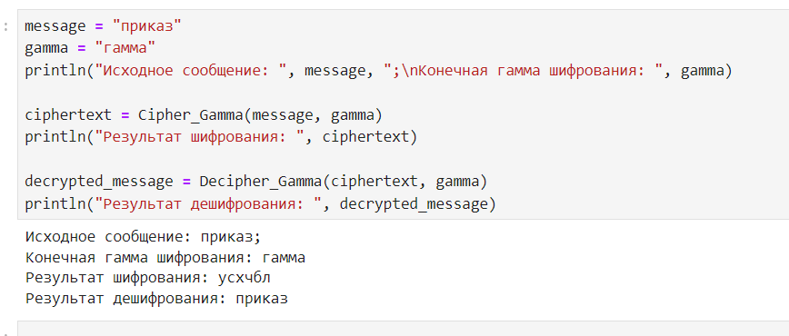

---
## Front matter
lang: ru-RU
title: Презентация по лабораторной работе №3
subtitle: Шифрование гаммированием
author:
  - Саргсян А. Г.
institute:
  - Российский университет дружбы народов, Москва, Россия
date: 12 октября 2024

## i18n babel
babel-lang: russian
babel-otherlangs: english

## Formatting pdf
toc: false
toc-title: Содержание
slide_level: 2
aspectratio: 169
section-titles: true
theme: metropolis
header-includes:
 - \metroset{progressbar=frametitle,sectionpage=progressbar,numbering=fraction}
---

# Цель работы 

Цель:
Изучить метод шифрования гаммированием

Задачи:
Реализовать алгоритм шифрования конечной гаммой.

## Гаммирование 

Гаммирование — это наложение на открытые данные последовательности элементов других данных.

Наложение гаммы по сути представляет собой выполнение операции
сложения по модулю 2.

$$ 0 \oplus 0 = 0, 0 \oplus 1 = 1, 1 \oplus 0 = 1, 1 \oplus 1 = 0.  $$

## Вывод результатов шифрования

{#fig:001 width=70%}

## Выводы

Я реализовал алгоритм шифрование конечной гаммой.
