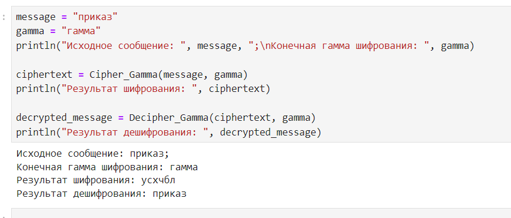

---
## Front matter
title: "Отчет по лабораторной работе №3"
subtitle: "Шифрование гаммированием"
author: "Арам Грачьяевич Саргсян"

## Generic otions
lang: ru-RU
toc-title: "Содержание"

## Bibliography
bibliography: bib/cite.bib
csl: pandoc/csl/gost-r-7-0-5-2008-numeric.csl

## Pdf output format
toc: true # Table of contents
toc-depth: 2
lof: true # List of figures
lot: true # List of tables
fontsize: 12pt
linestretch: 1.5
papersize: a4
documentclass: scrreprt
## I18n polyglossia
polyglossia-lang:
  name: russian
  options:
	- spelling=modern
	- babelshorthands=true
polyglossia-otherlangs:
  name: english
## I18n babel
babel-lang: russian
babel-otherlangs: english
## Fonts
mainfont: IBM Plex Serif
romanfont: IBM Plex Serif
sansfont: IBM Plex Sans
monofont: IBM Plex Mono
mathfont: STIX Two Math
mainfontoptions: Ligatures=Common,Ligatures=TeX,Scale=0.94
romanfontoptions: Ligatures=Common,Ligatures=TeX,Scale=0.94
sansfontoptions: Ligatures=Common,Ligatures=TeX,Scale=MatchLowercase,Scale=0.94
monofontoptions: Scale=MatchLowercase,Scale=0.94,FakeStretch=0.9
mathfontoptions:
## Biblatex
biblatex: true
biblio-style: "gost-numeric"
biblatexoptions:
  - parentracker=true
  - backend=biber
  - hyperref=auto
  - language=auto
  - autolang=other*
  - citestyle=gost-numeric
## Pandoc-crossref LaTeX customization
figureTitle: "Рис."
tableTitle: "Таблица"
listingTitle: "Листинг"
lofTitle: "Список иллюстраций"
lotTitle: "Список таблиц"
lolTitle: "Листинги"
## Misc options
indent: true
header-includes:
  - \usepackage{indentfirst}
  - \usepackage{float} # keep figures where there are in the text
  - \floatplacement{figure}{H} # keep figures where there are in the text
---

# Цель работы

Изучить метод шифрования гаммированием

# Задание

Реализовать алгоритм шифрования конечной гаммой.

# Теоретическое введение

Гаммирование представляет собой наложение (снятие) на открытые (зашифрованные) данные последовательности элементов других данных, 
полученной с помощью некоторого криптографического алгоритма, для получения зашифрованных (открытых) данных. Иными словами, наложение
гаммы — это сложение её элементов с элементами открытого (закрытого)
текста по некоторому фиксированному модулю, значение которого представляет собой известную часть алгоритма шифрования.
В соответствии с теорией криптоанализа, если в методе шифрования используется однократная вероятностная гамма (однократное гаммирование)
той же длины, что и подлежащий сокрытию текст, то текст нельзя раскрыть.
Даже при раскрытии части последовательности гаммы нельзя получить информацию о всём скрываемом тексте.
Наложение гаммы по сути представляет собой выполнение операции
сложения по модулю 2 (XOR) (обозначаемая знаком $\oplus$) между элементами
гаммы и элементами подлежащего сокрытию текста. Напомним, как работает операция XOR над битами: $$ 0 \oplus 0 = 0, 0 \oplus 1 = 1, 1 \oplus 0 = 1, 1 \oplus 1 = 0.  $$
Такой метод шифрования является симметричным, так как двойное прибавление одной и той же величины по модулю 2 восстанавливает исходное значение, 
а шифрование и расшифрование выполняется одной и той же программой[-@1].

# Выполнение лабораторной работы

1. Я реализовал необходимый программный комплекс.

```julia
alphabet = 'а':'я'
function Text_to_Numbers(Text::String, Alphabet::StepRange{Char, Int64} = alphabet)::Vector{Any}
    numbers = []
    for char in lowercase(Text)
        push!(numbers, findfirst(c -> c == char, Alphabet))
    end
    return numbers
end

function Numbers_to_Text(Numbers::Vector{Any}, Alphabet::StepRange{Char, Int64} = alphabet)::String
    text = ""
    for number in Numbers
        text *= alphabet[number]
    end
    return lowercase(text)
end

function Cipher_Gamma(Message::String, Gamma::String, Alphabet::StepRange{Char, Int64} = alphabet)::String
    Message_Numbers = Text_to_Numbers(Message, Alphabet)
    Gamma_Numbers = Text_to_Numbers(Gamma, Alphabet)
    length_alphabet = length(Alphabet)
    Encrypted_Numbers = []
    for i in 1:length(Message_Numbers)
        encrypted_number = (Message_Numbers[i] + Gamma_Numbers[(i-1) % length(Gamma_Numbers) + 1]) % length_alphabet
        push!(Encrypted_Numbers, encrypted_number == 0 ? length_alphabet : encrypted_number)
    end
    return Numbers_to_Text(Encrypted_Numbers, Alphabet)
end

function Decipher_Gamma(Encrypted_Message::String, Gamma::String, Alphabet::StepRange{Char, Int64} = alphabet)::String
    Encrypted_Numbers = Text_to_Numbers(Encrypted_Message, Alphabet)
    Gamma_Numbers = Text_to_Numbers(Gamma, Alphabet)
    length_alphabet = length(Alphabet)
    Message_Numbers = []
    for i in 1:length(Encrypted_Numbers)
        message_number = (Encrypted_Numbers[i] - Gamma_Numbers[(i-1) % length(Gamma_Numbers) + 1]) % length_alphabet
        push!(Message_Numbers, message_number == 0 ? length_alphabet : message_number)
    end
    return Numbers_to_Text(Message_Numbers, Alphabet)
end

message = "приказ"  
gamma = "гамма"     
println("Исходное сообщение: ", message, ";\nКонечная гамма шифрования: ", gamma)

ciphertext = Cipher_Gamma(message, gamma)
println("Результат шифрования: ", ciphertext)

decrypted_message = Decipher_Gamma(ciphertext, gamma)
println("Результат дешифрования: ", decrypted_message)
```

2. Получил результаты, аналогичные примеру (рис. [-@fig:001]).

{#fig:001 width=70%}

# Выводы

Я реализовал алгоритм шифрование конечной гаммой.

# Список литературы{.unnumbered}

::: {#refs}
:::
