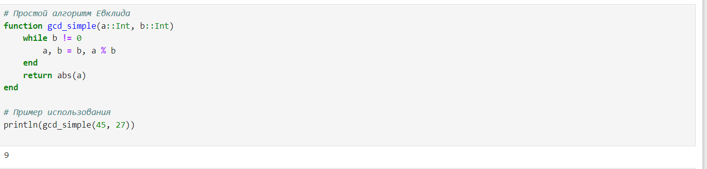
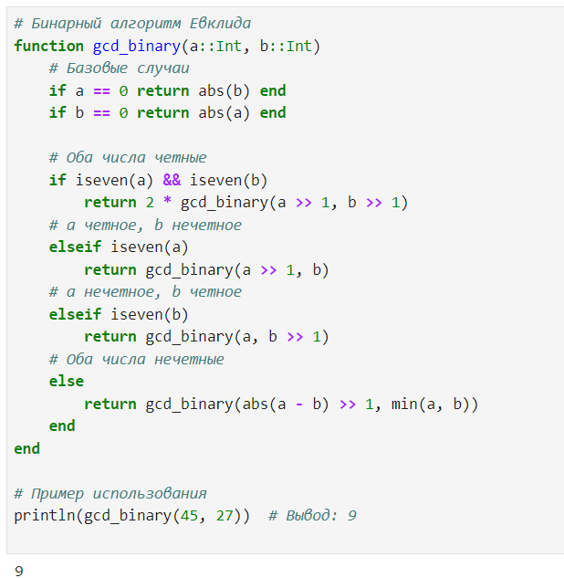

---
## Front matter
lang: ru-RU
title: Презентация по лабораторной работе №4
subtitle: Вычисление наибольшего общего делителя
author:
  - Саргсян А. Г.
institute:
  - Российский университет дружбы народов, Москва, Россия
date: 21 октября 2024

## i18n babel
babel-lang: russian
babel-otherlangs: english

## Formatting pdf
toc: false
toc-title: Содержание
slide_level: 2
aspectratio: 169
section-titles: true
theme: metropolis
header-includes:
 - \metroset{progressbar=frametitle,sectionpage=progressbar,numbering=fraction}
---

# Цель работы 

Цель:
Изучить алгоритмы вычисления наибольшего общего делителя

Задачи:
Реализовать алгоритмы Евклида для вычисления НОД.

## Базовый алгоритм  

{#fig:001 width=70%}

## Бинарный алгоритм

{#fig:002 width=70%}

## Выводы

Я реализовал алгоритмы Евклида для вычисления НОД.
