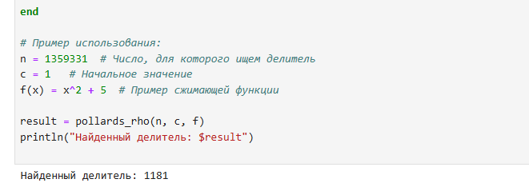

---
## Front matter
lang: ru-RU
title: Презентация по лабораторной работе №6
subtitle: Разложение чисел на множители
author:
  - Саргсян А. Г.
institute:
  - Российский университет дружбы народов, Москва, Россия
date: 23 ноября 2024

## i18n babel
babel-lang: russian
babel-otherlangs: english

## Formatting pdf
toc: false
toc-title: Содержание
slide_level: 2
aspectratio: 169
section-titles: true
theme: metropolis
header-includes:
 - \metroset{progressbar=frametitle,sectionpage=progressbar,numbering=fraction}
---

## Цель работы 

Изучить вероятностные алгоритмы проверки чисел на простоту.

##  Теста Ферма

{#fig:001 width=50%}

## Выводы

Я реализовал алгоритм разложения чисел на множители.
